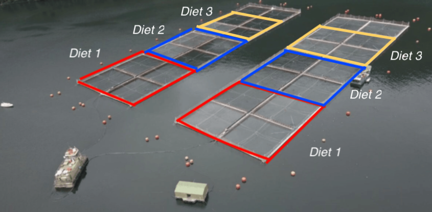
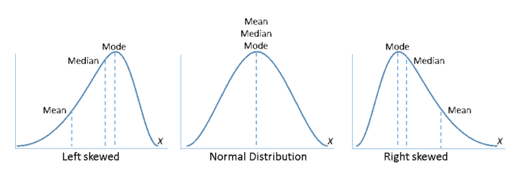

```{r setup, include=FALSE}
knitr::opts_chunk$set(echo = FALSE)
library(car)
library(lmtest)
library(dplyr)
library(knitr)
library(ggplot2)

My_Theme = theme(
  axis.title.x = element_text(size = 20),
  axis.text.x = element_text(size = 20),
  axis.title.y = element_text(size = 20),
  axis.text.y = element_text(size = 20))
```

# PLAN DE LA CLASE
**1.- Introducción**
    
- Supuestos de los análisis paramétricos.   
- Consecuencias de la violación de los supuestos.
- Métodos gráficos y análisis de residuos para evaluar supuestos.
- Pruebas de hipótesis para evaluar supuestos.

**2.- Práctica con R y Rstudio cloud**

- Evaluar supuestos de las pruebas paramétricas.
- Elaborar un reporte dinámico en formato html.  

# SUPUESTOS: INDEPENDENCIA

**Independencia**  
Cada observación de la muestra no debe estar relacionada con otra observación de la muestra.

```{r, echo=FALSE, out.width = '90%' }

```


# INDEPENDENCIA: MEDIDAS REPETIDAS

```{r, echo=FALSE, out.width = '90%' }
knitr::include_graphics("pareadas.png")
```

# INDEPENDENCIA: CORRELACIÓN ESPACIAL

```{r, echo=FALSE, out.width = '100%', fig.align='center'}

```

# INDEPENDENCIA: CORRELACIÓN TEMPORAL

```{r, echo=FALSE, out.width = '100%', fig.align='center'}
knitr::include_graphics("Independence_temporal.png")
```


# SUPUESTOS: HOMOGENEIDAD DE VARIANZAS

**Homocedasticidad**  
En el caso de comparación de dos o más muestras éstas deben provenir de poblaciones con la misma varianza.
```{r, echo=FALSE, out.width = '100%' }
knitr::include_graphics("anova.png")
```

*Alguna heterogeneidad es permitida, particularmente con* **_n > 30_**.

# SUPUESTOS: NORMALIDAD

**Normalidad**  
Los residuos de tus datos tienen distribución normal.   

```{r, echo=FALSE, out.width = '80%', fig.align='center'}
curve(dnorm,-4,4, ylab = "density", xlab = "residuales")
#rnorm
par(xpd=T)
points(rnorm(100),jitter(rep(0,100)),pch=16,cex=1,col='seagreen')
par(xpd=F)
mtext(side=3,line=.3,'X ~ Normal(0,1)',cex=1.2,font=4)
```

# VIOLACIÓN DEL SUPUESTO DE NORMALIDAD

**¿Cuál es el problema?**  
Cambia la probabilidad de rechazar la hipótesis nula.

```{r, echo=FALSE, out.width = '110%' }

```

*En la práctica apróximadamente normal es suficiente, particularmente con* **_n > 30_**.


# EVALUACIÓN DE SUPUESTOS: RESIDUALES

**¿Qué son los residuales?**  
Residuo = valor observado - valor predicho  
e = y - $\hat{y}$ 

**Residuos en ANOVA**
$$\sum_{i=1}^{n} (y - \hat{y})^2$$
*Note que la suma de residuos representa la variabilidad no explicada por el modelo.*


# EVALUACIÓN DE SUPUESTOS: PRUEBAS DE HIPÓTESIS

**Pruebas de hipótesis por supuesto**  
- Independencia: Prueba de Durwin-Watson  
- Homogeneidad de varianzas: Prueba de Levene
- Normalidad: Prueba de Shapiro-Wilks  

**Regla de oro**  
1.- Primero evalúe independencia..\
&nbsp;    
2.- Luego homogeneidad de varianzas..\
&nbsp;    
3.- Finalmente normalidad..\
&nbsp;      

# ESTUDIO DE CASO: CRECIMIENTO DE PLANTAS

```{r}
my_data <- PlantGrowth
my_data%>% 
  ggplot(aes(x=group,y=weight,fill=group))+
      geom_boxplot()+
     theme(legend.position="none")+
     labs(x="Group",y="Dried weight")+My_Theme
```

# ANOVA EN LA FORMA DE MODELO LINEAL

```{r, echo=TRUE}
lm.aov <- lm(weight ~ group, data = my_data)
anova(lm.aov) %>% kable(digits = 3)
```

# INDEPENDENCIA: ANÁLISIS DE RESIDUALES

```{r, echo=TRUE}
plot(lm.aov$residuals, pch=20, col = "blue",
     cex.lab=1.25, cex.axis=1.25)
```

# INDEPENDENCIA: PRUEBA DE DURBIN-WATSON

**Hipótesis**  
**H~0~**: Son independientes o no existe autocorrelación.   
**H~A~**: No son independientes y existe autocorrelación.  

```{r, echo=TRUE}
dwtest(weight ~ group, data = my_data,
       alternative = c("two.sided"), 
       iterations = 15) # library(lmtest)

```

# HOMOGENEIDAD DE VARIANZAS: ANÁLISIS DE RESIDUALES

```{r, echo=TRUE,out.width = '85%', fig.align='center'}
plot(lm.aov, 1, pch=20, col = "blue",
     cex.lab=1.5, cex.axis=1.5, sub = "")
```


# HOMOGENEIDAD DE VARIANZAS: PRUEBA DE LEVENE

**H~0~**:  $\sigma^2_1$ = $\sigma^2_2$  
**H~A~**: $\sigma^2_1$ $\neq$ $\sigma^2_2$  

```{r, echo=TRUE}
leveneTest(weight ~ group, data = my_data,
           center = "median") # library(car)  
```

# NORMALIDAD: ANÁLISIS DE RESIDUALES

```{r, echo=TRUE}
plot(lm.aov, 2, pch=20, col = "blue")
```

# NORMALIDAD: ANÁLISIS DE RESIDUALES 2


```{r, echo=TRUE, out.width = '85%'}
qqPlot(lm.aov) # library(car)
```


# NORMALIDAD: PRUEBA DE SHAPIRO-WILKS

**H~0~**: La distribución es normal.     
**H~A~**: La distribución no es normal.    

```{r, echo=TRUE}
aov_residuals <- residuals(object = lm.aov)
shapiro.test(x= aov_residuals)

```

# PRÁCTICA ANÁLISIS DE DATOS

- El trabajo práctico se realiza en Rstudio.cloud.  
**Clase 12 - Evaluación de supuestos**

# RESUMEN DE LA CLASE

- **Teoría**
- Supuestos de los análisis paramétricos.   
- Consecuencias de la violación de los supuestos.
- Interpretación de métodos gráficos, análisis de residuos y pruebas de hipótesis para evaluar supuestos.

- **Evaluación de supuestos**
    * Independencia.  
    * Homocedasticidad.
    * Normalidad.
    