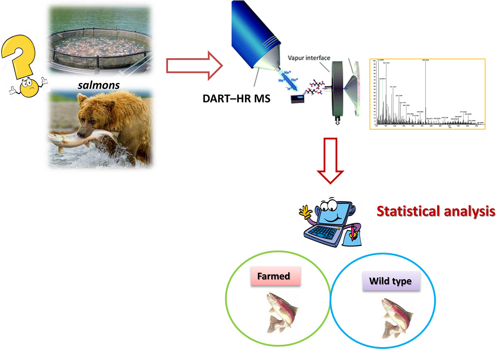
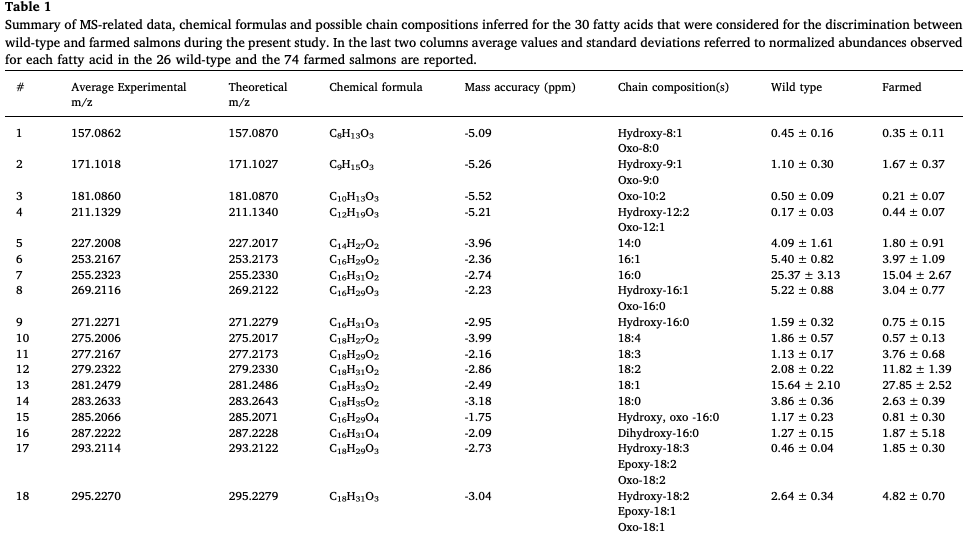
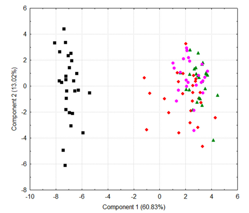
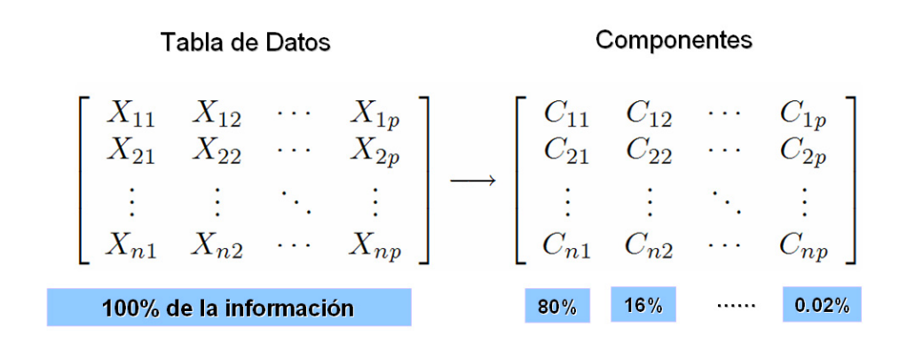
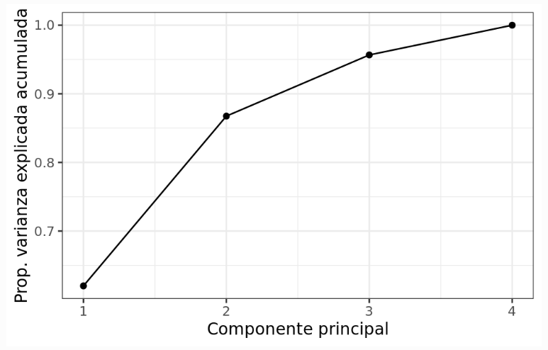
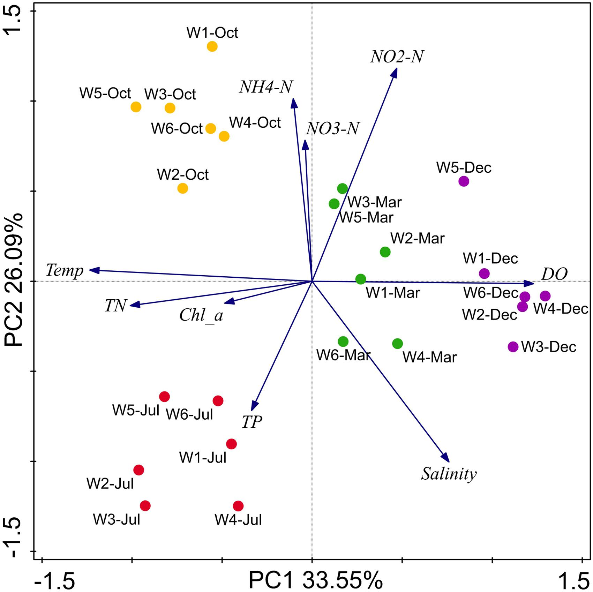

```{r setup, include=FALSE}
knitr::opts_chunk$set(echo = FALSE)
library(readxl)
library(ggplot2)
library(dplyr)
library(knitr)

```

# PLAN DE LA CLASE

**1.- Introducción**
    
- ¿Qué son los análisis de componentes principales?
- ¿Qué son los componentes principales?
- Estudio de caso: Detectar fraude alimentario.
- Etapas para realizar un ACP.
- Varianza explicada.
- Graficas biplot.

**2). Práctica con R y Rstudio cloud.**

- Elaborar análisis de componentes principales con R.

# ANÁLISIS DE COMPONENTES PRINCIPALES

- **¿Qué son los análisis de componentes principales?**   
a) Son una herramienta estadística multivariada que se utiliza para realizar análisis exploratorio de datos y para construir modelos predictivos.\
&nbsp;
b) Permite reducir la dimensionalidad de un set de datos con muchas variables respuesta, sin perder mucha información.\
&nbsp;
c) Permite encontrar patrones en un set de datos mediante el cálculo de los “componentes principales”.
d) En inteligencia artificial, se utiliza como método de aprendizaje automático no supervisado.


# ESTUDIO DE CASO: FRAUDE ALIMENTARIO.

- ¿Cómo distinguir filetes de salmón silvestre y de cultivo?
```{r, out.width='80%'}

```

[Fuente: Fiorino et al. 2019](https://doi.org/10.1016/j.foodres.2018.10.013)

# ESTUDIO DE CASO: ANÁLISIS MULTIVARIADO

- 2 grupos se revelan en función del análisis de acidos grasos.
```{r, out.width='110%'}

```

# ESTUDIO DE CASO: ANÁLISIS DE COMPONENTES PRINCIPALES

```{r, out.width='70%'}

```

# COMPONENTES PRINCIPALES

- ¿Qué son los componentes principales?  
Combinación lineal de las variables originales no correlacionadas entre si (perpendiculares / ortogonales).

```{r, echo=FALSE, out.width = '90%' }
knitr::include_graphics("CP.png")
```

# ETAPAS PARA REALIZAR UN ACP

1) Estandarizar datos: Media 0 y varianza 1.
2) Calcular matriz de distancia (euclideana) de valores estandarizados.
3) Calcular valores y vectores propios (Eigenvalue y Eigenvector) de la matriz estandarizada.
4) Interpretación y gráficas biplot.

# MATRIZ DE DISTANCIA EUCLIDEANA
- Usar con variables cuantitativas continuas. \
&nbsp;
- Comparar efecto escala de las variables. \
&nbsp;
```{r}
bioenv <- read_excel("bioenv.xlsx", sheet = 1)
tabla <- bioenv %>% select(Sitio, Depth, Pollution, Temperature) %>% filter(Sitio %in% c("s29", "s30"))

kable(tabla)
```

  $s29-s30=\sqrt{(x_1-y_1)^2+(x_2-y_2)^2+(x_3-y_3)^2}$.\
&nbsp;
  
  $s29-s30=\sqrt{(51-99)^2+(6.0-1.9)^2+(3.0-2.9)^2}$.\
&nbsp;
  
  $s29-s30=\sqrt{(2304)+(18.81)+(0.01)}= 48.17$
  
# ESTANDARIZACIÓN

|  | **Depth**| **Pollution** | **Temperature** |
|:------:|:------:|:------:|:------:|
| **Mean** | 74,43 | 4,52 | 3,06 |
| **sd** | 15,61 | 2,14 | 0,28 |

Valor estandarizado : (valor original – mean) / sd  
Valor estandarizado s29 : (51 – 74,43) / 16,61 = -1,501

| **Sitio** | **Depth**| **Pollution** | **Temperature** |
|:------:|:------:|:------:|:------:|
| **s29** | -1,501 | 0,693 | -0,201 |
| **s30** | 1,573 | -1,222 | -0,557 |


# DISTANCIA EUCLIDEANA ESTANDARIZADA

| **Sitio** | **Depth**| **Pollution** | **Temperature** |
|:------:|:------:|:------:|:------:|
| **s29** | -1,501 | 0,693 | -0,201 |
| **s30** | 1,573 | -1,222 | -0,557 |

  $s29-s30=\sqrt{(-1,50-1,57)^2+(0,69-1,22)^2+(0,20-0,55)^2}$.\
&nbsp;
  
  Distancia estandarizada.  
  $s29-s30=\sqrt{(9,499)+(3,667)+(0,127)}= 3,639$.\
&nbsp;
  Distancia no estandarizada.  
  $s29-s30=\sqrt{(2304)+(18.81)+(0.01)}= 48.17$
  
# COMPONENTES PRINCIPALES

- Cada componente principal se obtiene por combinación lineal de las variables originales.
```{r, echo=FALSE, out.width = '80%' }

```

Fuente: [Rodriguez](http://www.oldemarrodriguez.com/yahoo_site_admin/assets/docs/cap2.143111051.pdf)

# VARIANZA EXPLICADA

La varianza explicada acumulada muestra que los primeros dos componentes principales pueden capturar mucha de la varianza explicada por todas las variables analizadas. Cada eigenvalue estima la varianza explicada por cada CP.

```{r, echo=FALSE, out.width = '80%' }

```

# GRÁFICAS BI-PLOT

- 2 eigenvector o componentes principales para cada variable.
- Correlación de variables + observaciones.

```{r, echo=FALSE, out.width = '60%' }

```

Fuente: [He, et al. 2017](https://www.frontiersin.org/articles/10.3389/fmicb.2017.01579/full)

# RESUMEN DE LA CLASE

- ¿Qué es un análisis de componentes principales?.\
&nbsp;
- ¿Qué son los componentes principales?.\
&nbsp;
- Etapas para realizar un ACP.\
&nbsp;
- Varianza explicada.\
&nbsp;
- Graficas biplot.