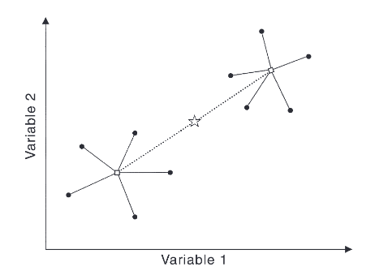
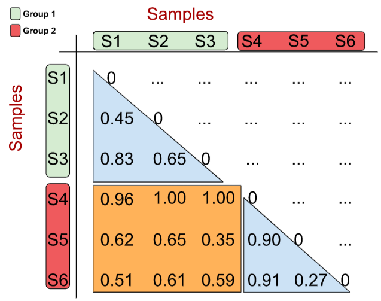

```{r setup, include=FALSE}
knitr::opts_chunk$set(echo = FALSE)
library(readxl)
library(ggplot2)
library(dplyr)
library(knitr)
```

# PLAN DE LA CLASE

**1.- Introducción**
    
- ¿Qué son los PERMANOVA?
- Etapas para realizar un ACP.
- Varianza explicada.
- Graficas biplot

**2). Práctica con R y Rstudio cloud.**

- Elaborar análisis de componentes principales con R

# ANÁLISIS DE VARIANZA MULTIVARIANTE PERMUTACIONAL

- **¿Qué es un PERMANOVA?**   
a) Es una prueba estadística multivariada No paramétrica.\
&nbsp;
b) Determina, en términos simples, si el centroides de un conjunto de observacione difiere del centróide de otro grupo.

```{r, echo=FALSE, out.width = '60%' }

```

[Fuente: Anderson, 2001](https://doi.org/10.1111/j.1442-9993.2001.01070.pp.x)

# PERMANOVA

- Con base a comparar la matriz de distancia o similaridad.

```{r, echo=FALSE, out.width = '70%' }

```

[Fuente: Rodriguez, 2022](http://www.oldemarrodriguez.com/yahoo_site_admin/assets/docs/cap2.143111051.pdf)

# VENTAJAS Y SUPUESTOS

- Características
a) PERMANOVA no asume ninguna distribución.  
b) Sensible a variación entre grupos (heterocedasticidad).  
c) Es insensible a la multicoliniealidad.  
d) Permite múltiples variables.  
e) Insensible a los ceros.  

- Supuestos
a) Las observaciones son intercambiables entre grupos.
b) Similar distribución entre grupos.
c) Muestras independientes.\
&nbsp;  
[Fuente: Anderson, 2001](https://doi.org/10.1111/j.1442-9993.2001.01070.pp.x)


# PERMANOVA: TEST ESTADÍSTICO

- Hipótesis.
a) $H_0$= No existe diferencia entre los grupos.
b) $H_1$= Al menos dos grupos son diferentes.

- Estadístico.\
&nbsp;  
$F = \frac{SS_a:(a-1)}{SSw:(N-1)}$.\
&nbsp;

$SS_a$ = variación entre grupos.  
$SS_w$ = variación dentro de grupos.\
&nbsp;

- Distribución del estadístico.  
La distribución del estadístico se realiza por permutación.\
&nbsp;


# RESUMEN DE LA CLASE

- ¿Qué es un PERMANOVA.\
&nbsp;
- Supuestos.\
&nbsp;
- Interpretación.\
&nbsp;
- Elaborar PERMANOVA con R.\
&nbsp;